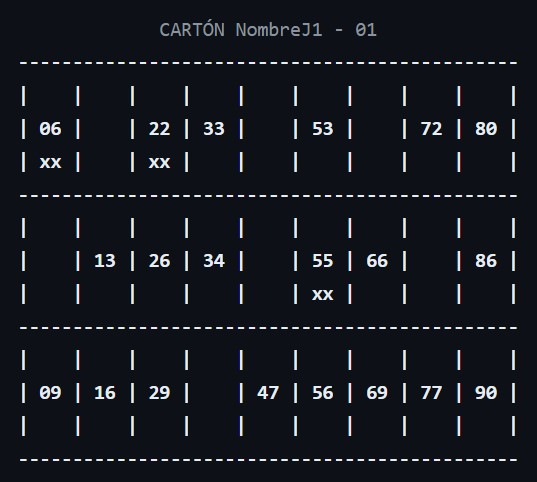

# PRO_2324_U7_Bingo

Vamos a desarrollar una aplicación con POO que nos permita jugar al Bingo y registrar información en ficheros.

## Características principales:

   * Cuando se inicie la app, debe dar la opción a que puedan participar uno o más jugadores *(la máquina siempre juega)*. El número máximo de jugadores será 3 *(con la CPU serán 4)*.
	
   * Cada `Jugador` tendrá un identificador único, un nombre y podrá jugar con 1 o más cartones.
	
   * Un `Carton` será una estructura de datos de 27 posiciones.
	
   * Almacenará 18 números aleatorios de la siguiente manera:
	 		 * 2 col. con 3 números (6)
			 * 5 col. con 2 números (10)
			 * 2 col. con 1 número  (2)
			
   * Los posibles valores de las columnas serán los siguientes:
	    * 1ª col. puede contener valores del 1 al 9
	    * 2ª col. puede contener valores del 10 al 19
	    * ...
	    * 9ª col. puede ontener valores del 80 al 90.
			
   * Si una celda no tiene valor su contenido será `null`.
		
   * Si una celda contiene un número debe mostrarse formateado a dos posiciones con 0 a la izquierda si es necesario.
		
   * Un cartón debe mostrarse por consola cómo el siguiente ejemplo:

   
		
   * La posición (fila) de los números de cada columna debe ser calculado de forma aleatoria al crear el cartón. Pero deben mostrarse de arriba a abajo de menor a mayor.
		
   * Debe existir una clase `Bombo`, que tendrá una `pila` de 90 bolas del bingo. Contendrá un método llamado `sacarBolas()` que devolverá 1 o varios números del bombo, según indique su parámetro de entrada *(por defecto retornará solo 1)*.
	
   * Los números o bolas que extraigamos del bombo, deben almacenarse en un `fichero de log` según su orden de salida, que indicará el número extraido, los jugadores y cartones que tenían dicho número y la posición del mismo en el cartón *(si está en varios cartones del mismo o distintos jugadores, se almacenarán del jugador 1 al N, igual que los cartones)*.
	
   * El fichero debe llamarse logBingo_YYYYMMDD_HHMMSS.txt
	
   * Dicho fichero debe iniciarse con una primera línea que indique: "Juego del Bingo 08/04/2024 11:38", a continuación mostrará el nombre de cada jugador y los cartones que están jugando (tal y cómo se mostraba en el ejemplo anterior).
	
   * A partir de aquí irá registrando:

      ```kotlin
      Ronda  1 - 22 01 77 90
      22 - NombreJ1: cartón01 (1, 3)
      22 - NombreJ2 cartón01 (2, 3) cartón02 (1, 3)
      ...   
      ¡Línea de NombreJ2!
      ...   
      ¡NombreJ1 a 3 bolas!
      ...  
      ¡¡¡Bingo de NombreJ1!!!
      ```
     
	
   * Debe producirse una pausa para que el usuario pulse INTRO cada ronda que el bombo retorne bolas.
		
   * El programa debe comenzar preguntando el número de jugadores (si pulsa INTRO sin escribir nada, se asume el valor por defecto 1) y después el número de cartones que tendrá cada jugador (si pulsa INTRO sin escribir nada, se asume el valor por defecto 1).
	
   * El juego comienza limpiando la pantalla y mostrando los cartones de la CPU *(siempre jugador 1)* y el resto de jugadores.
	
   * Después realizará una pausa hasta que el usuario pulse INTRO...
	
   * Se limpiará la pantalla.
	
   * El bombo extraerá de 4 a 6 bolas y se mostrarán por pantalla.
	
   * Se producirá una pausa de 1 sg.
	
   * Se mostrarán los cartones de los jugadores con los aciertos producidos.
	
   * Según el orden de aparición de los números un jugador puede cantar "línea" *(se mostrará en pantalla ¡NombreJugador ha cantado línea!)*
	
   * Se producirá siempre después de cada ronda, si no hay un ganador, una pausa hasta que el usuario pulse INTRO... se limpiará la pantalla y comenzará otra ronda.
	
   * Se debe mostrar por pantalla la ronda que se está ejecutando.
	
   * Desde la ronda en la que un jugador canta línea, el bombo solo extrae 3 bolas cada vez.
	
   * Cuando un jugador esté a 3 números de ganar *(¡NombreJugador está a 3 números de completar un cartón!)*... las siguientes rondas el bombo solo retornará 1 número.
	
   * En los cartones debe marcarse debajo del número con la marca "xx" que ese número ha salido.
	
   * Cada jugador debe llevar un registro del orden de aparición de sus números con fecha, hora minuto y segundo. Este registro se realizará mediante un fichero con el nombre logBingo_YYYMMDD_HHMMSS_IDJUGADOR.txt
	
## Análisis.

Primero debéis realizar un pequeño análisis en grupo y determinar las clases que vais a necesitar en vuestro proyecto. Realizar una pequeña descripción de su funcionalidad. las propiedades y métodos que va a tener cada clase.

Para dejar registro de vuestro planteamiento debéis crear un fichero que se llame ANALISIS.md dónde documentaréis todo. El fichero README.md debe tener justo debajo de esta línea el enlace al fichero ANALISIS.md que debéis crear:

## Desarrollo.

Debéis incluir un proyecto de Gradle con vuestra solución. No utilicéis ningún Object en este proyecto, para que tengáis que realizar correctamente la inyección de dependencia cuando sea necesario *(es decir, cuando tengamos que utilizar un servicio en alguna clase)*

Si lo consideráis necesario para vuestra lógica podéis incluir `Companion object` en nivel de clase para crear alguna propiedad o método estático.

La aplicación estructurarse para que inicialmente desarrollemos todo sin ninguna librería externa, pero después ese servicio de impresión o registro pueda intercambiarse por uno que utilice la librería externa mordant para la visualización por consola de la información.

